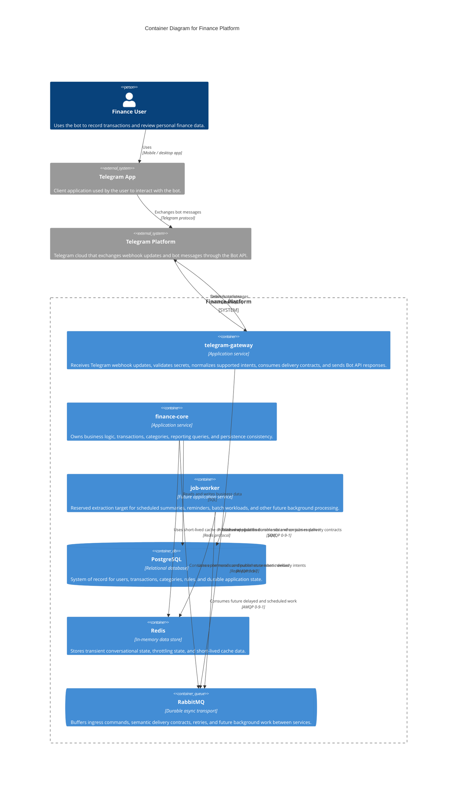

# C4 Container Diagram

This diagram decomposes the `Finance Platform` into its main deployable containers and supporting data and integration components.

## Scope

- The system of interest is `Finance Platform`
- `telegram-gateway` is the Telegram-facing ingress boundary inside the platform
- Internal containers are based on the service model and shared platform components described in the architecture documents

## Notes

- `telegram-gateway` and `finance-core` are the active runtime containers in v1
- `job-worker` remains in the model as a future extraction target instead of a current delivery participant
- `PostgreSQL`, `Redis`, and `RabbitMQ` are shown inside the platform boundary as required runtime containers, even though they are infrastructure components rather than domain services
- Telegram is external to the platform, while the Telegram-specific ingress boundary lives inside `telegram-gateway`
