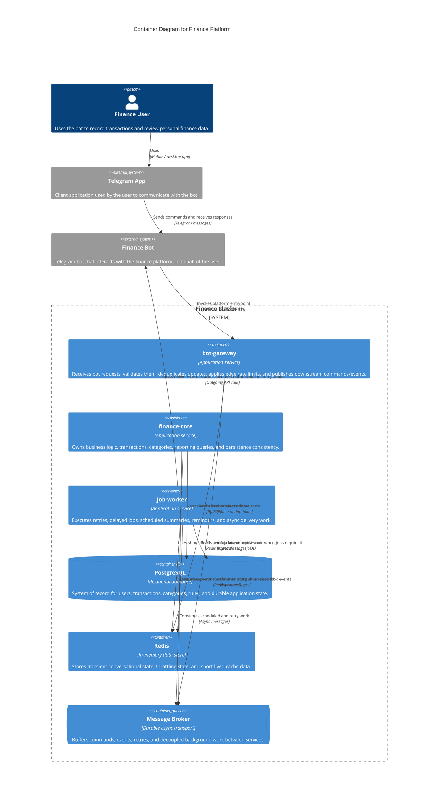

# C4 Container Diagram

This diagram decomposes the `Finance Platform` into its main deployable containers and supporting data/integration components.

## Scope

- The system of interest is `Finance Platform`.
- `Finance Bot` stays outside the platform boundary and acts as the Telegram-facing client of the platform.
- Internal containers are based on the service model and shared platform components described in the architecture documents.

## Notes

- `bot-gateway`, `finance-core`, and `job-worker` are the three application containers defined by the architecture.
- `PostgreSQL`, `Redis`, and `Message Broker` are shown inside the platform boundary as required runtime containers, even though they are infrastructure components rather than domain services.
- `Finance Bot` is kept outside the platform boundary because it is the Telegram-facing interaction layer, not part of the core platform itself.
