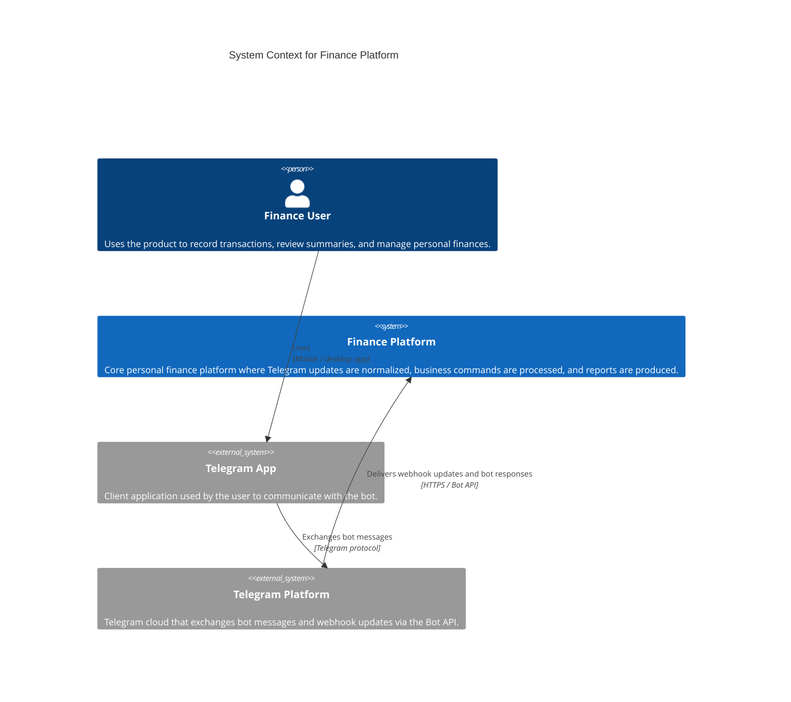

# C4 Context Diagram

This diagram shows the finance platform at the highest level of abstraction together with the end user and the Telegram systems through which the user interacts with the platform.

## Context

- The platform is a Telegram personal finance system
- Internal services such as `telegram-gateway`, `finance-core`, and `job-worker` are intentionally hidden at this level
- The Telegram-facing ingress boundary is part of the finance platform, not an external service

## Notes

- `Finance Platform` is the system of interest on this diagram
- Telegram is shown as the external system through which users and the platform exchange bot traffic
- Application services are not shown here because they belong to the next C4 level: Container
