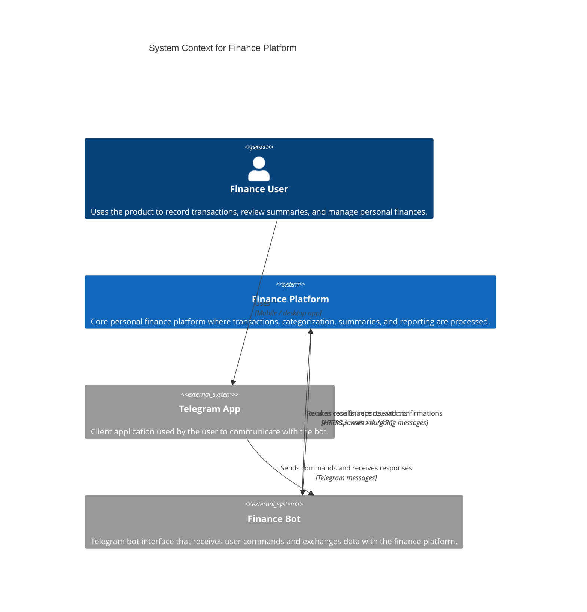

# C4 Context Diagram

This diagram shows the system at the highest level of abstraction: the finance platform, the end user, and the Telegram-facing bot layer through which the user interacts with the platform.

## Context

- The platform is a Telegram personal finance system.
- Internal services such as `bot-gateway`, `finance-core`, and `job-worker` are intentionally hidden at this level.
- The goal of this view is to show the real user interaction chain: user -> Telegram app -> finance bot -> finance platform.

## Notes

- `Finance Platform` is the system of interest on this diagram.
- `Finance Bot` is shown separately because it is the user-facing bot layer through which Telegram interactions reach the platform.
- Application services are not shown here because they belong to the next C4 level: Container.
