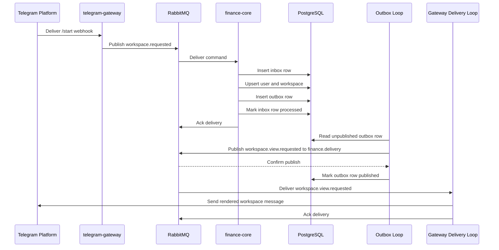

# Finance Core And Gateway Delivery Sequence

This sequence shows the v1 `workspace.requested` path from Telegram ingress to outbound Telegram delivery.

## Notes

- The command is acknowledged only after the PostgreSQL transaction commits
- The outbox loop is separate from command processing to preserve transactional integrity
- `finance-core` publishes semantic contracts and does not render Telegram payloads
- `telegram-gateway` renders Bot API payloads and treats outbound delivery as at-least-once
