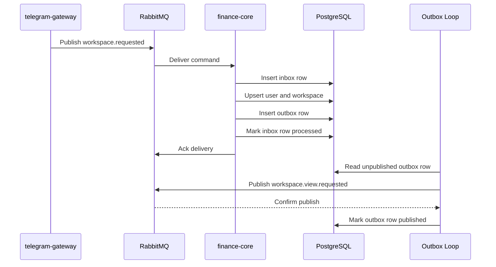

# Finance Core Command Sequence

This sequence shows the v1 command path for `workspace.requested`.

## Notes

- The command is acknowledged only after the PostgreSQL transaction commits
- The outbox loop is separate from command processing to preserve transactional integrity
- Downstream consumers must treat outbound messages as at-least-once deliveries
