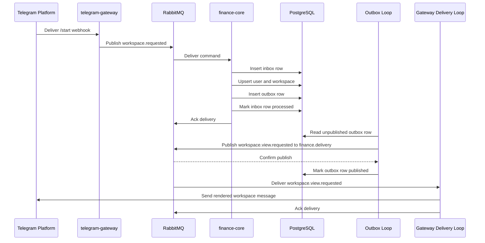
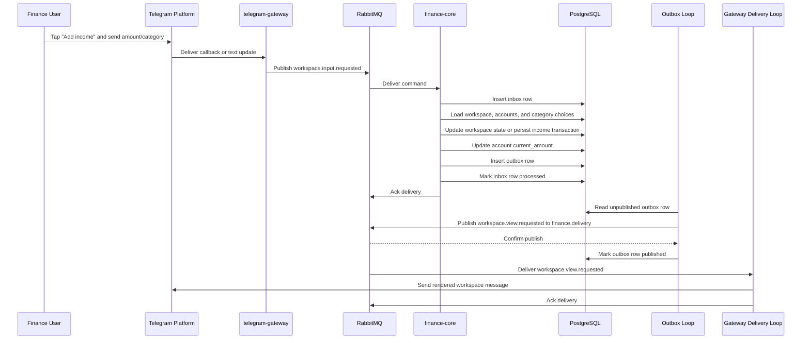

# Finance Core And Gateway Delivery Sequence

These sequences show the current v1 workspace paths from Telegram ingress to outbound Telegram delivery.

## Workspace Open Or Restore

## Add Income Transaction

## Notes

- Both `workspace.requested` and `workspace.input.requested` are acknowledged only after the PostgreSQL transaction commits
- The outbox loop is separate from command processing to preserve transactional integrity
- `finance-core` publishes semantic contracts and does not render Telegram payloads
- `telegram-gateway` renders Bot API payloads and treats outbound delivery as at-least-once
- Income and expense flows reuse the same durable command, workspace, and outbox pattern
